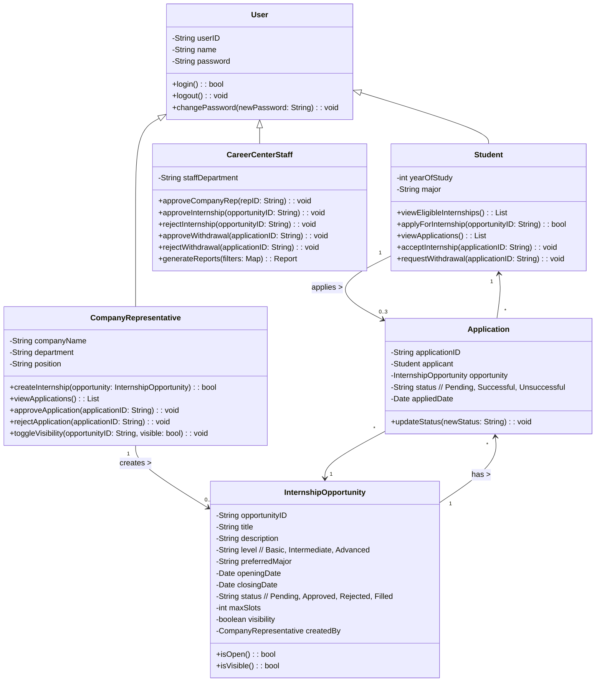
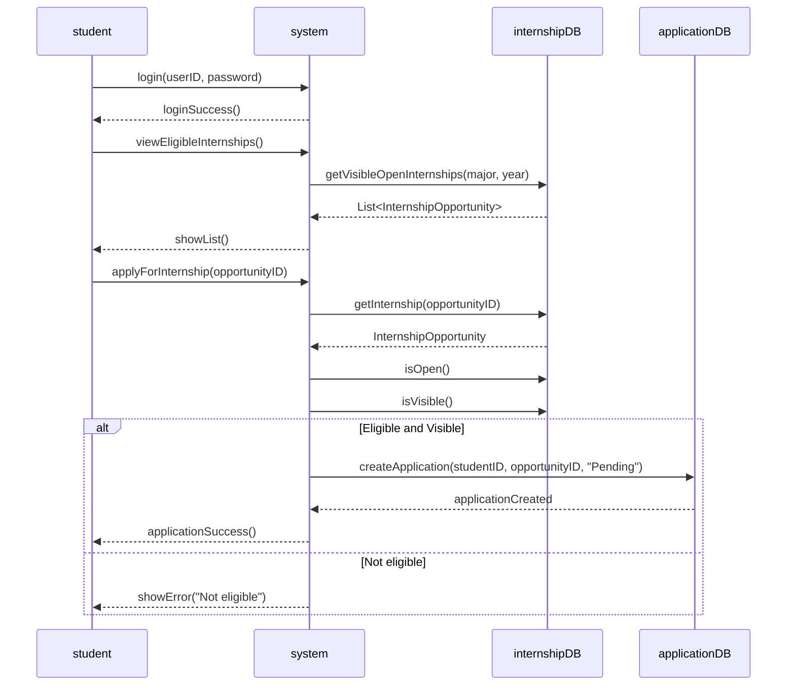
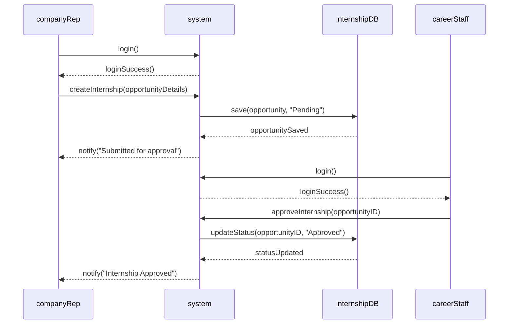
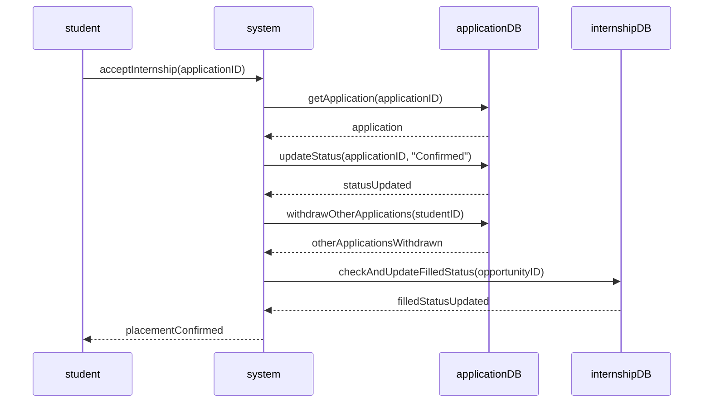
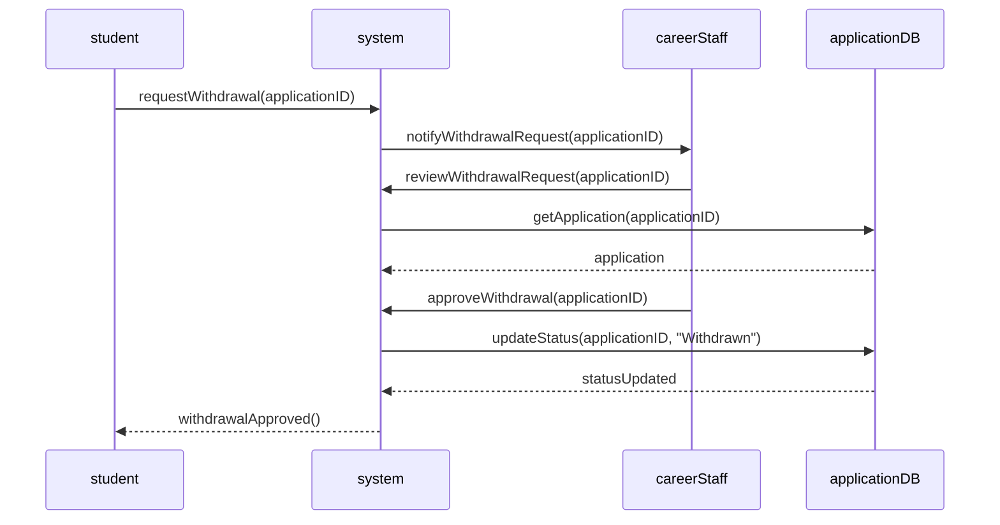
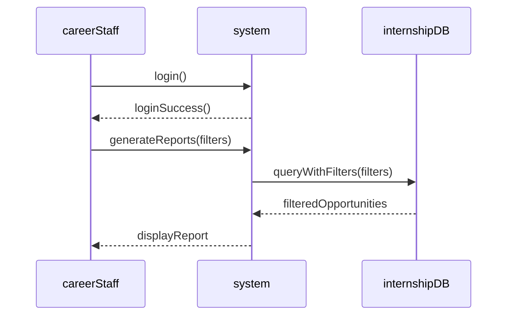
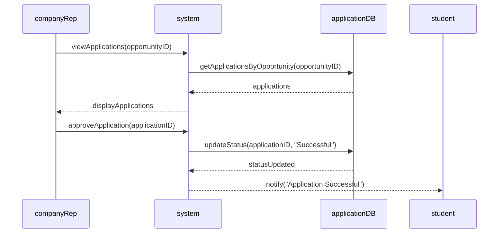
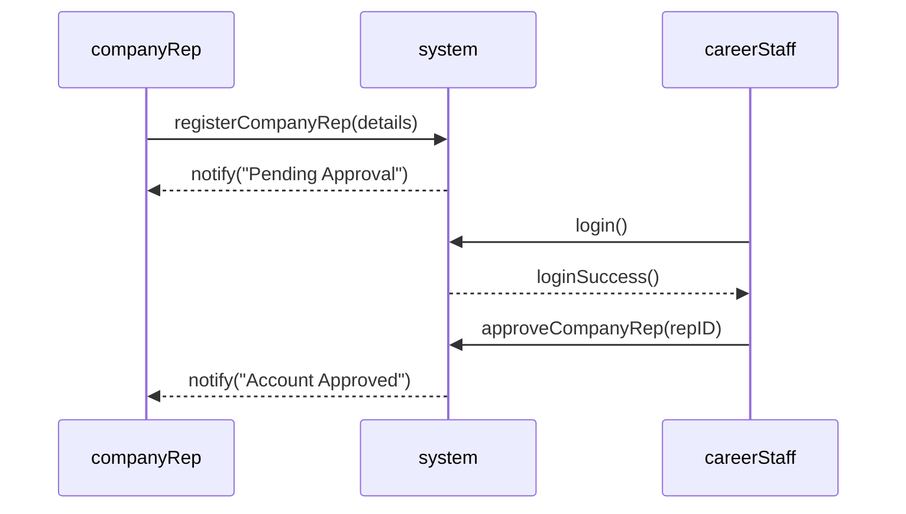

# sc2002-oop-assignment
An Internship Placement System, designed with Object-Oriented Principles

# UML Class Diagram

# UML Sequence Diagrams

## Apply for Intern

## Create Internship

## Accept Internship

## Withdraw from Application

## Generate Report

## Approve Application

## Approve Rep Acct

