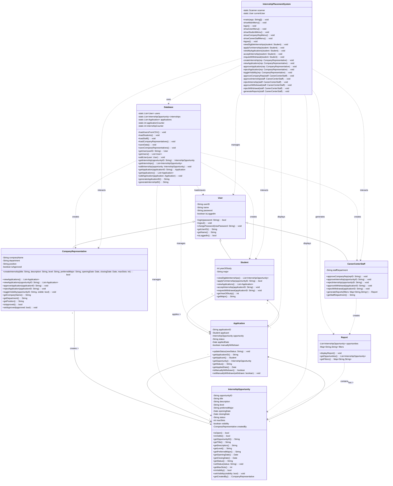
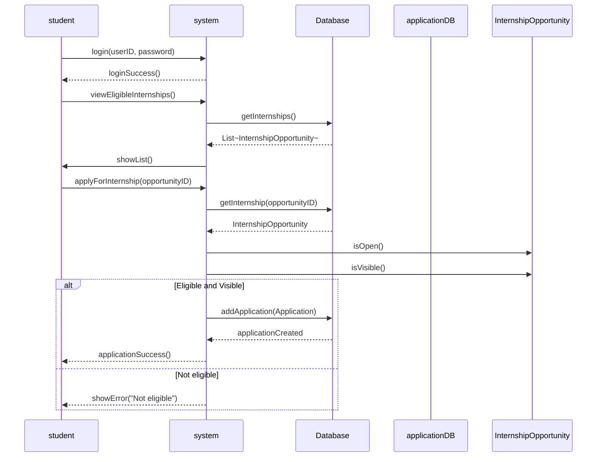
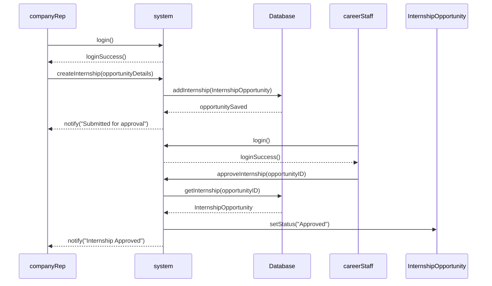
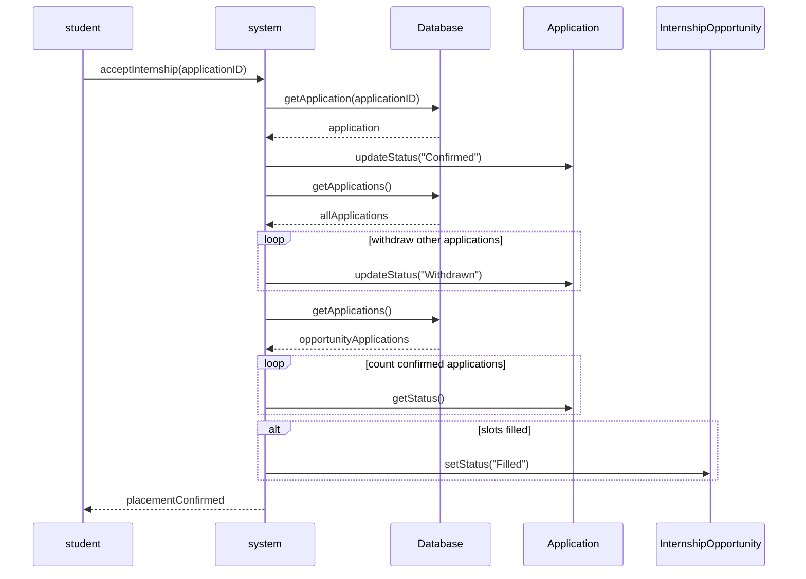
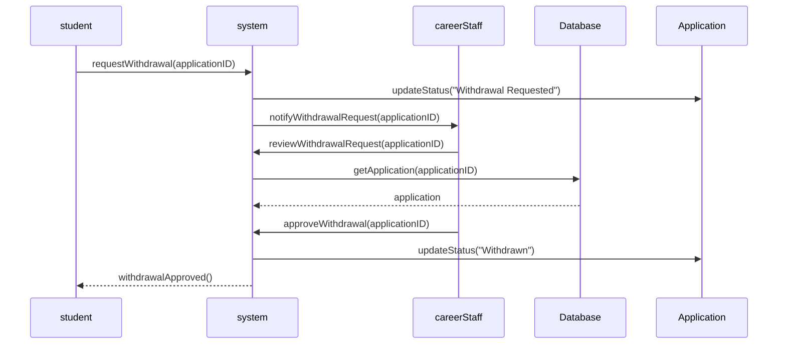
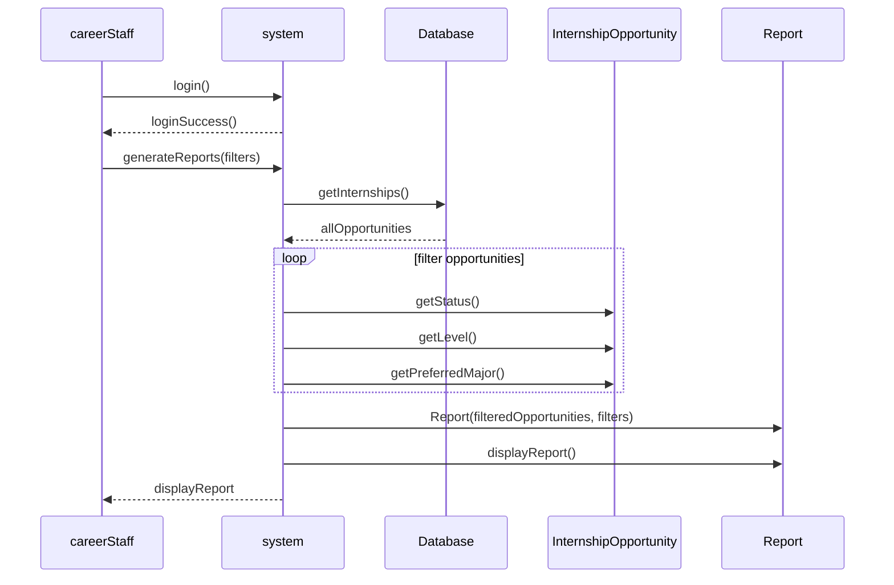
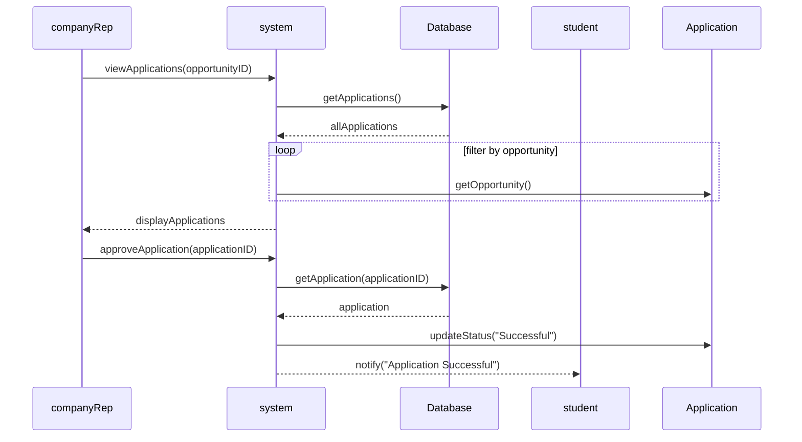
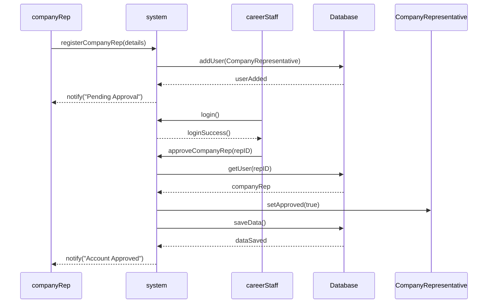

# sc2002-oop-assignment

An Internship Placement System, designed with Object-Oriented Principles

## Features

- **User Management**: Three user types (Students, Company Representatives, Career Center Staff)
- **Internship Management**: Create, approve, and manage internship opportunities
- **Application Process**: Students can apply for internships, track applications, and accept offers
- **Approval Workflows**: Career center staff approve company reps and internships
- **Reporting**: Generate filtered reports on internship opportunities
- **Data Persistence**: CSV-based storage for user data
- **Batch Processing**: Space-separated IDs for mass operations (apply, process applications, toggle visibility)
- **Waitlist System**: Automatic queue management for filled internships with FIFO processing
- **Smart Status Management**: Automatic status updates when slots become available

## Recent Enhancements (v2.0.0)

### Flexible Withdrawal System

- **Multi-Stage Withdrawal**: Students can request withdrawal at any stage (Pending, Successful, or Confirmed)
- **Smart Processing**: Career staff approval intelligently handles different withdrawal scenarios
- **Automatic Queue Advancement**: When confirmed placements are withdrawn, queued students automatically advance
- **Status Transparency**: UI displays current application status for informed withdrawal decisions

### User Experience

- **Pre-Display Lists**: Students see eligible internships before applying, successful/confirmed applications before accepting/withdrawing
- **Batch Operations**: Space-separated IDs for applying to multiple internships and processing applications
- **Clean Professional UI**: Removed all emojis, replaced with text markers ([SUCCESS], [FAILED])
- **Password Security**: Prevents users from setting new password same as current

### Advanced Features

- **Waitlist Queue**: Students added to queue when internship is full, automatically confirmed when slots open
- **Manual Withdrawal Tracking**: Prevents reapplication to internships students manually withdrew from
- **Auto Status Updates**: Internships automatically change from "Filled" to "Approved" when slots become available
- **Queue Processing**: Automatic confirmation of queued applications in FIFO order

## System Architecture

### Classes

- `User`: Base class for all users
- `Student`: Extends User, handles student operations with enhanced validation
- `CompanyRepresentative`: Extends User, manages company internships
- `CareerCenterStaff`: Extends User, admin functions with queue processing
- `InternshipOpportunity`: Represents internship postings
- `Application`: Manages student applications with manual withdrawal tracking
- `Database`: Handles data persistence and CSV operations
- `Report`: Generates filtered reports
- `InternshipPlacementSystem`: Main CLI application with batch processing
- `UIHelper`: Centralized UI formatting utilities

### Data Storage

- Users are loaded from CSV files:
  - `sample_student_list.csv`
  - `sample_staff_list.csv`
  - `sample_company_representative_list.csv`
- Internships and applications are stored in memory during runtime

## Usage

### Compile and Run

```bash
javac *.java
java InternshipPlacementSystem
```

### Default Login Credentials

All users have default password: `password`

#### Students

- U2310001A (Tan Wei Ling, Computer Science, Year 2)
- U2310002B (Ng Jia Hao, Data Science & AI, Year 3)
- U2310003C (Lim Yi Xuan, Computer Engineering, Year 4)
- U2310004D (Chong Zhi Hao, Information Engineering & Media, Year 1)
- U2310005E (Wong Shu Hui, Computer Science, Year 3)

#### Career Center Staff

- sng001 (Dr. Sng Hui Lin)
- tan002 (Mr. Tan Boon Kiat)
- lee003 (Ms. Lee Mei Ling)

## Workflow

1. **Company Representatives** must be approved by Career Center Staff before creating internships
2. **Internships** start as "Pending" and must be approved by Career Center Staff
3. **Students** can only apply to approved, visible internships matching their major
4. **Applications** go through approval/rejection workflow
5. **Students** can accept successful offers and request withdrawals at any stage (Pending, Successful, or Confirmed)
6. **Waitlist Queue** automatically manages students when internships are full
7. **Withdrawal Processing** by Career Staff triggers queue advancement for confirmed placements

## Key Features Explained

### Withdrawal System

- **Pending Stage**: Student can withdraw before company processes application
- **Successful Stage**: Student can withdraw after approval but before accepting
- **Confirmed Stage**: Student can withdraw after accepting placement
- All withdrawals must be approved by Career Center Staff
- Confirmed withdrawals trigger automatic queue processing

### Batch Processing

- Apply to multiple internships: `INT0001 INT0002 INT0003`
- Process multiple applications: `APP0001 APP0002 APP0003`
- Toggle multiple visibility settings: `INT0001 INT0002`

### Waitlist Queue

- Automatically activated when internship reaches max slots
- Students added to queue in FIFO order
- Queue automatically processed when slots become available
- Queued students notified of automatic confirmation

### Manual Withdrawal Tracking

- Students who manually withdraw cannot reapply to same internship
- Prevents abuse of placement system
- Tracked via `manuallyWithdrawn` flag in Application class

## Documentation

- **CHANGELOG.md**: Complete version history and feature additions
- **IMPROVEMENTS.md**: Detailed enhancement descriptions beyond base requirements
- **TEST_VERIFICATION.md**: Validation of all 20 specification test cases
- **README.md**: This file - system overview and usage guide

# UML Class Diagram



# UML Sequence Diagrams

## Apply for Intern



## Create Internship



## Accept Internship



## Withdraw from Application



## Generate Report



## Approve Application



## Approve Rep Acct


