# UML Diagrams

This document contains the UML diagrams for the refactored Internship Placement System.

## UML Class Diagram

```mermaid
classDiagram
    class User {
        -String userID
        -String name
        -String password
        -boolean isLoggedIn
        +login(password: String): bool
        +logout(): void
        +changePassword(newPassword: String): void
        +getUserID(): String
        +getName(): String
        +isLoggedIn(): bool
    }

    class Student {
        -int yearOfStudy
        -String major
        -double gpa
        +viewEligibleInternships(): List~InternshipOpportunity~
        +applyForInternship(opportunityID: String): bool
        +viewApplications(): List~Application~
        +acceptInternship(applicationID: String): void
        +requestWithdrawal(applicationID: String): void
        +isEligibleForInternship(opportunity: InternshipOpportunity): bool
        +getYearOfStudy(): int
        +getMajor(): String
        +getGpa(): double
    }

    class CompanyRepresentative {
        -String companyName
        -String department
        -String position
        -boolean isApproved
        -String email
        +createInternship(title: String, description: String, level: String, preferredMajor: String, openingDate: Date, closingDate: Date, maxSlots: int): bool
        +viewApplications(): List~Application~
        +viewApplications(opportunityID: String): List~Application~
        +processApplication(applicationID: String, approve: boolean): void
        +getPendingApplications(): List~Application~
        +toggleVisibility(opportunityID: String, visible: bool): void
        +getCompanyName(): String
        +getDepartment(): String
        +getPosition(): String
        +isApproved(): bool
        +setApproved(approved: bool): void
        +getEmail(): String
    }

    class CareerCenterStaff {
        -String staffDepartment
        +processCompanyRep(repID: String, approve: boolean): void
        +processInternship(opportunityID: String, approve: boolean): void
        +processWithdrawal(applicationID: String, approve: boolean): void
        +getPendingCompanyReps(): List~CompanyRepresentative~
        +getPendingInternships(): List~InternshipOpportunity~
        +getWithdrawalRequests(): List~Application~
        +generateReports(filters: Map~String,String~): Report
        +getStaffDepartment(): String
    }

    class InternshipOpportunity {
        -String opportunityID
        -String title
        -String description
        -String level
        -String preferredMajor
        -Date openingDate
        -Date closingDate
        -String status
        -int maxSlots
        -boolean visibility
        -double minGPA
        -CompanyRepresentative createdBy
        +isOpen(): bool
        +isVisible(): bool
        +getOpportunityID(): String
        +getTitle(): String
        +setTitle(title: String): void
        +getDescription(): String
        +setDescription(description: String): void
        +getLevel(): String
        +setLevel(level: String): void
        +getPreferredMajor(): String
        +setPreferredMajor(major: String): void
        +getOpeningDate(): Date
        +setOpeningDate(date: Date): void
        +getClosingDate(): Date
        +setClosingDate(date: Date): void
        +getStatus(): String
        +setStatus(status: String): void
        +getMaxSlots(): int
        +setMaxSlots(slots: int): void
        +isVisibility(): bool
        +setVisibility(visibility: bool): void
        +getMinGPA(): double
        +setMinGPA(minGPA: double): void
        +getCreatedBy(): CompanyRepresentative
    }

    class Application {
        -String applicationID
        -Student applicant
        -InternshipOpportunity opportunity
        -String status
        -Date appliedDate
        -boolean manuallyWithdrawn
        +updateStatus(newStatus: String): void
        +getApplicationID(): String
        +getApplicant(): Student
        +getOpportunity(): InternshipOpportunity
        +getStatus(): String
        +getAppliedDate(): Date
        +isManuallyWithdrawn(): boolean
        +setManuallyWithdrawn(withdrawn: boolean): void
    }

    class Database {
        -static List~User~ users
        -static List~InternshipOpportunity~ internships
        -static List~Application~ applications
        -static int applicationCounter
        -static int internshipCounter
        -static int companyRepCounter
        +loadUsersFromCSV(): void
        +loadStudents(): void
        +loadStaff(): void
        +loadCompanyRepresentatives(): void
        +loadApplications(): void
        +saveData(): void
        +saveStudents(): void
        +saveStaff(): void
        +saveCompanyRepresentatives(): void
        +saveApplications(): void
        +getUser(userID: String): User
        +getUsers(): List~User~
        +addUser(user: User): void
        +getInternship(opportunityID: String): InternshipOpportunity
        +getInternships(): List~InternshipOpportunity~
        +addInternship(opportunity: InternshipOpportunity): void
        +removeInternship(opportunityID: String): void
        +getApplication(applicationID: String): Application
        +getApplications(): List~Application~
        +addApplication(application: Application): void
        +generateApplicationID(): String
        +generateInternshipID(): String
        +generateCompanyRepID(): String
    }

    class Report {
        -List~InternshipOpportunity~ opportunities
        -Map~String,String~ filters
        +displayReport(): void
        +getOpportunities(): List~InternshipOpportunity~
        +getFilters(): Map~String,String~
    }

    class FilterSettings {
        -String statusFilter
        -String levelFilter
        -String majorFilter
        -double minGPAFilter
        -String sortBy
        +setStatusFilter(status: String): void
        +setLevelFilter(level: String): void
        +setMajorFilter(major: String): void
        +setMinGPAFilter(minGPA: double): void
        +setSortBy(sortBy: String): void
        +hasActiveFilters(): bool
        +clearFilters(): void
        +applyFilters(opportunities: List~InternshipOpportunity~): List~InternshipOpportunity~
        +toString(): String
    }

    class Statistics {
        -Map~String,Integer~ applicationCounts
        -Map~String,Integer~ acceptanceCounts
        -Map~String,Integer~ rejectionCounts
        -Map~String,Double~ averageGPAByLevel
        -int totalApplications
        -int totalAcceptances
        -int totalRejections
        +displayStudentStatistics(student: Student): void
        +displayCompanyRepresentativeStatistics(rep: CompanyRepresentative): void
        +displaySystemStatistics(): void
    }

    class IUserRepository {
        +getAllUsers(): List~User~
        +getUserById(userId: String): User
        +addUser(user: User): void
        +saveUsers(): void
        +generateCompanyRepId(): String
    }

    class CsvUserRepository {
        +getAllUsers(): List~User~
        +getUserById(userId: String): User
        +addUser(user: User): void
        +saveUsers(): void
        +generateCompanyRepId(): String
    }

    class IInternshipRepository {
        +getAllInternships(): List~InternshipOpportunity~
        +getInternshipById(opportunityId: String): InternshipOpportunity
        +addInternship(internship: InternshipOpportunity): void
        +removeInternship(opportunityId: String): void
        +saveInternships(): void
        +generateInternshipId(): String
    }

    class CsvInternshipRepository {
        +getAllInternships(): List~InternshipOpportunity~
        +getInternshipById(opportunityId: String): InternshipOpportunity
        +addInternship(internship: InternshipOpportunity): void
        +removeInternship(opportunityId: String): void
        +saveInternships(): void
        +generateInternshipId(): String
    }

    class IApplicationRepository {
        +getAllApplications(): List~Application~
        +getApplicationById(applicationId: String): Application
        +addApplication(application: Application): void
        +saveApplications(): void
        +generateApplicationId(): String
    }

    class CsvApplicationRepository {
        +getAllApplications(): List~Application~
        +getApplicationById(applicationId: String): Application
        +addApplication(application: Application): void
        +saveApplications(): void
        +generateApplicationId(): String
    }

    class UserService {
        -IUserRepository userRepository
        +login(userId: String, password: String): User
        +registerStudent(userId: String, name: String, password: String, yearOfStudy: int, major: String, gpa: double): bool
        +registerStaff(userId: String, name: String, password: String, department: String): bool
        +registerCompanyRep(userId: String, name: String, password: String, company: String, department: String, position: String, email: String): bool
        +approveCompanyRep(repId: String): void
    }

    class InternshipService {
        -IInternshipRepository internshipRepository
        -IUserRepository userRepository
        +createInternship(userId: String, title: String, description: String, level: String, preferredMajor: String, openingDate: Date, closingDate: Date, maxSlots: int, minGPA: double): bool
        +approveInternship(opportunityId: String): void
        +rejectInternship(opportunityId: String): void
        +getAllInternships(): List~InternshipOpportunity~
        +getInternship(id: String): InternshipOpportunity
        +toggleVisibility(opportunityId: String, visible: bool): void
    }

    class ApplicationService {
        -IApplicationRepository applicationRepository
        -IInternshipRepository internshipRepository
        -IUserRepository userRepository
        +applyForInternship(studentId: String, opportunityId: String): bool
        +approveApplication(applicationId: String): void
        +rejectApplication(applicationId: String): void
        +acceptInternship(applicationId: String): void
        +requestWithdrawal(applicationId: String): void
        +approveWithdrawal(applicationId: String): void
        +getApplicationsForStudent(studentId: String): List~Application~
        +getApplicationsForCompanyRep(repId: String): List~Application~
        +getApplicationsForInternship(opportunityId: String): List~Application~
    }

    class IMenuHandler {
        +showMenu(): void
    }

    class StudentMenuHandler {
        -Student student
        -InternshipService internshipService
        -ApplicationService applicationService
        -Scanner scanner
        +showMenu(): void
    }

    class CompanyRepMenuHandler {
        -CompanyRepresentative rep
        -InternshipService internshipService
        -ApplicationService applicationService
        -Scanner scanner
        +showMenu(): void
    }

    class CareerStaffMenuHandler {
        -CareerCenterStaff staff
        -UserService userService
        -InternshipService internshipService
        -ApplicationService applicationService
        -Scanner scanner
        +showMenu(): void
    }

    class InternshipPlacementSystem {
        -Scanner scanner
        -User currentUser
        -IUserRepository userRepository
        -IInternshipRepository internshipRepository
        -IApplicationRepository applicationRepository
        -UserService userService
        -InternshipService internshipService
        -ApplicationService applicationService
        +main(args: String[]): void
        -run(): void
        -showMainMenu(): void
        -showRegistrationMenu(): void
        -login(): void
        -registerStudent(): void
        -registerStaff(): void
        -registerCompanyRep(): void
        -showUserMenu(): void
    }

    User <|-- Student
    User <|-- CompanyRepresentative
    User <|-- CareerCenterStaff

    IUserRepository <|.. CsvUserRepository
    IInternshipRepository <|.. CsvInternshipRepository
    IApplicationRepository <|.. CsvApplicationRepository

    IMenuHandler <|.. StudentMenuHandler
    IMenuHandler <|.. CompanyRepMenuHandler
    IMenuHandler <|.. CareerStaffMenuHandler

    CompanyRepresentative "1" --> "0..5" InternshipOpportunity : creates >
    Student "1" --> "0..3" Application : applies >
    InternshipOpportunity "1" --> "*" Application : has >
    Application "*" --> "1" Student
    Application "*" --> "1" InternshipOpportunity

    CsvUserRepository ..> User : loads/saves
    CsvUserRepository ..> Student : creates
    CsvUserRepository ..> CompanyRepresentative : creates
    CsvUserRepository ..> CareerCenterStaff : creates

    CsvInternshipRepository ..> InternshipOpportunity : manages

    CsvApplicationRepository ..> Application : manages

    UserService ..> IUserRepository : uses
    InternshipService ..> IInternshipRepository : uses
    InternshipService ..> IUserRepository : uses
    ApplicationService ..> IApplicationRepository : uses
    ApplicationService ..> IInternshipRepository : uses
    ApplicationService ..> IUserRepository : uses

    StudentMenuHandler ..> InternshipService : uses
    StudentMenuHandler ..> ApplicationService : uses
    CompanyRepMenuHandler ..> InternshipService : uses
    CompanyRepMenuHandler ..> ApplicationService : uses
    CareerStaffMenuHandler ..> UserService : uses
    CareerStaffMenuHandler ..> InternshipService : uses
    CareerStaffMenuHandler ..> ApplicationService : uses

    InternshipPlacementSystem ..> IUserRepository : injects
    InternshipPlacementSystem ..> IInternshipRepository : injects
    InternshipPlacementSystem ..> IApplicationRepository : injects
    InternshipPlacementSystem ..> UserService : injects
    InternshipPlacementSystem ..> InternshipService : injects
    InternshipPlacementSystem ..> ApplicationService : injects
    InternshipPlacementSystem ..> IMenuHandler : uses

    CareerCenterStaff ..> Report : creates
    Report ..> InternshipOpportunity : contains

    Statistics ..> Student : analyzes
    Statistics ..> CompanyRepresentative : analyzes
    Statistics ..> InternshipOpportunity : analyzes
    Statistics ..> Application : analyzes

```

## UML Sequence Diagrams

### Refactored Login with Dependency Injection

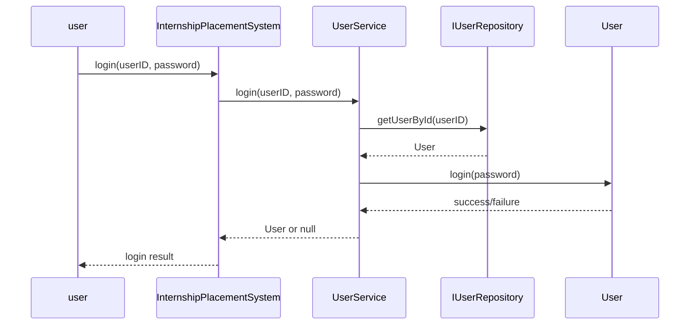
```mermaid
sequenceDiagram
    participant user
    participant InternshipPlacementSystem
    participant UserService
    participant IUserRepository

    user->>InternshipPlacementSystem: login(userID, password)
    InternshipPlacementSystem->>UserService: login(userID, password)
    UserService->>IUserRepository: getUserById(userID)
    IUserRepository-->>UserService: User
    UserService->>User: login(password)
    User-->>UserService: success/failure
    UserService-->>InternshipPlacementSystem: User or null
    InternshipPlacementSystem-->>user: login result

```

### Service-Based Application Submission

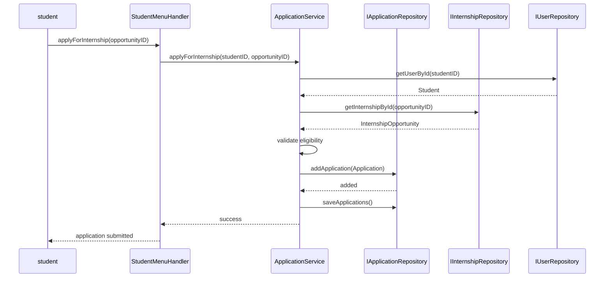
```mermaid
sequenceDiagram
    participant student
    participant StudentMenuHandler
    participant ApplicationService
    participant IApplicationRepository
    participant IInternshipRepository
    participant IUserRepository

    student->>StudentMenuHandler: applyForInternship(opportunityID)
    StudentMenuHandler->>ApplicationService: applyForInternship(studentID, opportunityID)
    ApplicationService->>IUserRepository: getUserById(studentID)
    IUserRepository-->>ApplicationService: Student
    ApplicationService->>IInternshipRepository: getInternshipById(opportunityID)
    IInternshipRepository-->>ApplicationService: InternshipOpportunity
    ApplicationService->>ApplicationService: validate eligibility
    ApplicationService->>IApplicationRepository: addApplication(Application)
    IApplicationRepository-->>ApplicationService: added
    ApplicationService->>IApplicationRepository: saveApplications()
    ApplicationService-->>StudentMenuHandler: success
    StudentMenuHandler-->>student: application submitted

```

### System Initialization with Dependency Injection

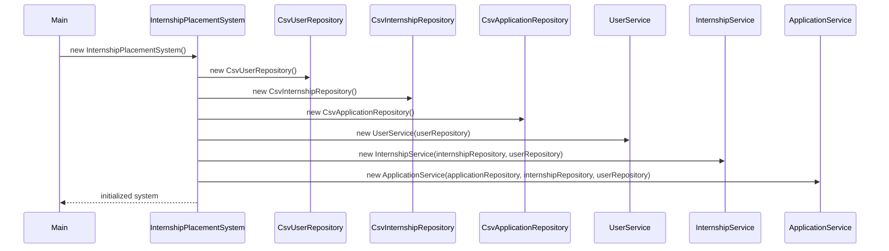
```mermaid
sequenceDiagram
    participant Main
    participant InternshipPlacementSystem
    participant CsvUserRepository
    participant CsvInternshipRepository
    participant CsvApplicationRepository
    participant UserService
    participant InternshipService
    participant ApplicationService

    Main->>InternshipPlacementSystem: new InternshipPlacementSystem()
    InternshipPlacementSystem->>CsvUserRepository: new CsvUserRepository()
    InternshipPlacementSystem->>CsvInternshipRepository: new CsvInternshipRepository()
    InternshipPlacementSystem->>CsvApplicationRepository: new CsvApplicationRepository()
    InternshipPlacementSystem->>UserService: new UserService(userRepository)
    InternshipPlacementSystem->>InternshipService: new InternshipService(internshipRepository, userRepository)
    InternshipPlacementSystem->>ApplicationService: new ApplicationService(applicationRepository, internshipRepository, userRepository)
    InternshipPlacementSystem-->>Main: initialized system

```

### User Registration via Services

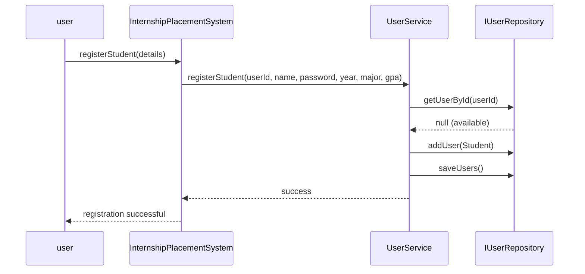
```mermaid
sequenceDiagram
    participant user
    participant InternshipPlacementSystem
    participant UserService
    participant IUserRepository

    user->>InternshipPlacementSystem: registerStudent(details)
    InternshipPlacementSystem->>UserService: registerStudent(userId, name, password, year, major, gpa)
    UserService->>IUserRepository: getUserById(userId)
    IUserRepository-->>UserService: null (available)
    UserService->>IUserRepository: addUser(Student)
    UserService->>IUserRepository: saveUsers()
    UserService-->>InternshipPlacementSystem: success
    InternshipPlacementSystem-->>user: registration successful

```

### User Login via Services

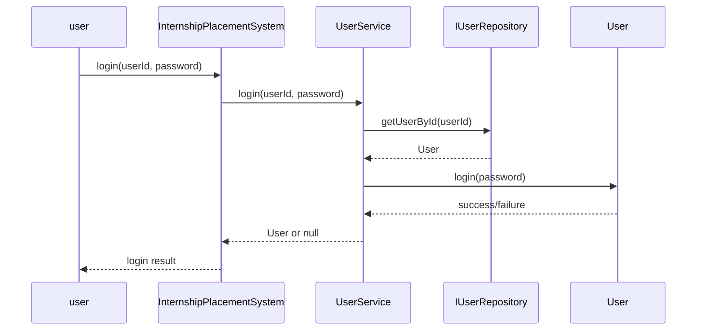
```mermaid
sequenceDiagram
    participant user
    participant InternshipPlacementSystem
    participant UserService
    participant IUserRepository

    user->>InternshipPlacementSystem: login(userId, password)
    InternshipPlacementSystem->>UserService: login(userId, password)
    UserService->>IUserRepository: getUserById(userId)
    IUserRepository-->>UserService: User
    UserService->>User: login(password)
    User-->>UserService: success/failure
    UserService-->>InternshipPlacementSystem: User or null
    InternshipPlacementSystem-->>user: login result

```

### Creating Internship via Services

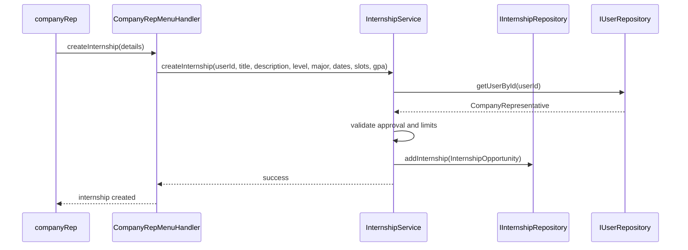
```mermaid
sequenceDiagram
    participant companyRep
    participant CompanyRepMenuHandler
    participant InternshipService
    participant IInternshipRepository
    participant IUserRepository

    companyRep->>CompanyRepMenuHandler: createInternship(details)
    CompanyRepMenuHandler->>InternshipService: createInternship(userId, title, description, level, major, dates, slots, gpa)
    InternshipService->>IUserRepository: getUserById(userId)
    IUserRepository-->>InternshipService: CompanyRepresentative
    InternshipService->>InternshipService: validate approval and limits
    InternshipService->>IInternshipRepository: addInternship(InternshipOpportunity)
    InternshipService-->>CompanyRepMenuHandler: success
    CompanyRepMenuHandler-->>companyRep: internship created

```

### Approving Application via Services

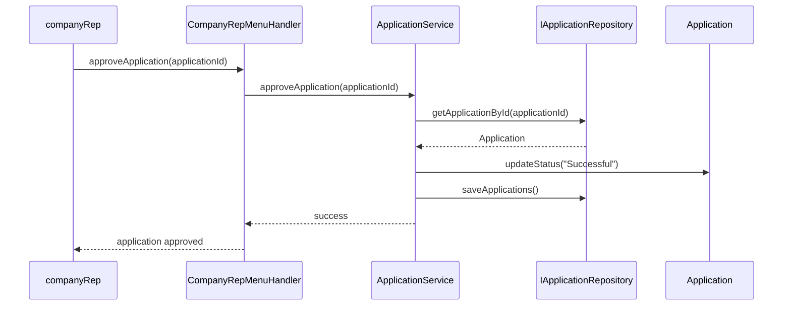
```mermaid
sequenceDiagram
    participant companyRep
    participant CompanyRepMenuHandler
    participant ApplicationService
    participant IApplicationRepository

    companyRep->>CompanyRepMenuHandler: approveApplication(applicationId)
    CompanyRepMenuHandler->>ApplicationService: approveApplication(applicationId)
    ApplicationService->>IApplicationRepository: getApplicationById(applicationId)
    IApplicationRepository-->>ApplicationService: Application
    ApplicationService->>Application: updateStatus("Successful")
    ApplicationService->>IApplicationRepository: saveApplications()
    ApplicationService-->>CompanyRepMenuHandler: success
    CompanyRepMenuHandler-->>companyRep: application approved

```

### Accepting Internship via Services

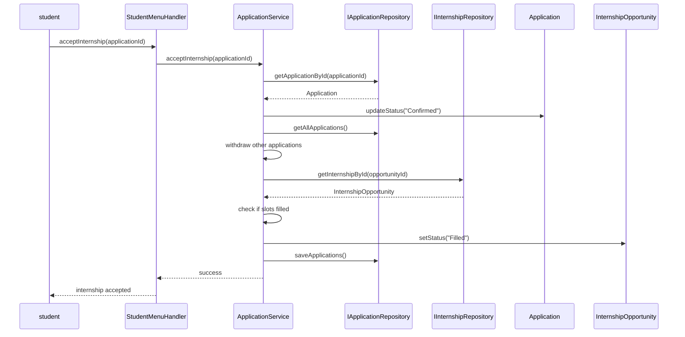
```mermaid
sequenceDiagram
    participant student
    participant StudentMenuHandler
    participant ApplicationService
    participant IApplicationRepository
    participant IInternshipRepository

    student->>StudentMenuHandler: acceptInternship(applicationId)
    StudentMenuHandler->>ApplicationService: acceptInternship(applicationId)
    ApplicationService->>IApplicationRepository: getApplicationById(applicationId)
    IApplicationRepository-->>ApplicationService: Application
    ApplicationService->>Application: updateStatus("Confirmed")
    ApplicationService->>IApplicationRepository: getAllApplications()
    ApplicationService->>ApplicationService: withdraw other applications
    ApplicationService->>IInternshipRepository: getInternshipById(opportunityId)
    IInternshipRepository-->>ApplicationService: InternshipOpportunity
    ApplicationService->>ApplicationService: check if slots filled
    ApplicationService->>InternshipOpportunity: setStatus("Filled")
    ApplicationService->>IApplicationRepository: saveApplications()
    ApplicationService-->>StudentMenuHandler: success
    StudentMenuHandler-->>student: internship accepted

```

### Requesting Withdrawal via Services

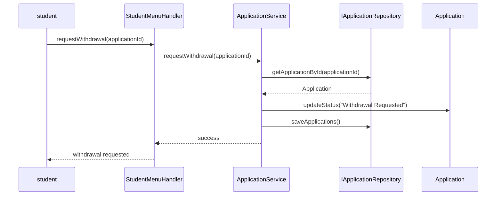
```mermaid
sequenceDiagram
    participant student
    participant StudentMenuHandler
    participant ApplicationService
    participant IApplicationRepository

    student->>StudentMenuHandler: requestWithdrawal(applicationId)
    StudentMenuHandler->>ApplicationService: requestWithdrawal(applicationId)
    ApplicationService->>IApplicationRepository: getApplicationById(applicationId)
    IApplicationRepository-->>ApplicationService: Application
    ApplicationService->>Application: updateStatus("Withdrawal Requested")
    ApplicationService->>IApplicationRepository: saveApplications()
    ApplicationService-->>StudentMenuHandler: success
    StudentMenuHandler-->>student: withdrawal requested

```

### Approving Withdrawal via Services

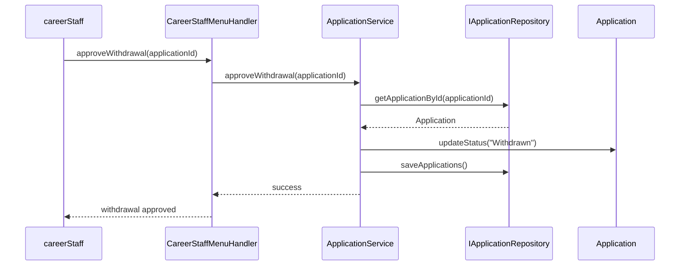
```mermaid
sequenceDiagram
    participant careerStaff
    participant CareerStaffMenuHandler
    participant ApplicationService
    participant IApplicationRepository

    careerStaff->>CareerStaffMenuHandler: approveWithdrawal(applicationId)
    CareerStaffMenuHandler->>ApplicationService: approveWithdrawal(applicationId)
    ApplicationService->>IApplicationRepository: getApplicationById(applicationId)
    IApplicationRepository-->>ApplicationService: Application
    ApplicationService->>Application: updateStatus("Withdrawn")
    ApplicationService->>IApplicationRepository: saveApplications()
    ApplicationService-->>CareerStaffMenuHandler: success
    CareerStaffMenuHandler-->>careerStaff: withdrawal approved

```

### Viewing Statistics via Services

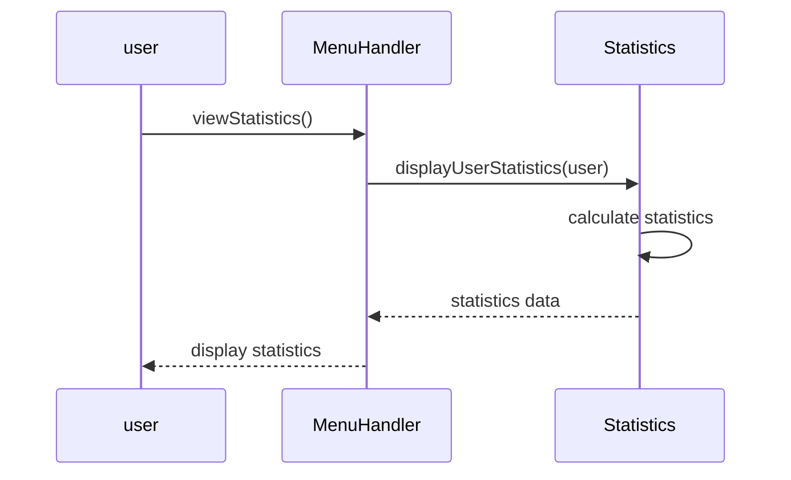
```mermaid
sequenceDiagram
    participant user
    participant MenuHandler
    participant Statistics

    user->>MenuHandler: viewStatistics()
    MenuHandler->>Statistics: displayUserStatistics(user)
    Statistics->>Statistics: calculate statistics
    Statistics-->>MenuHandler: statistics data
    MenuHandler-->>user: display statistics

```

### Generating Reports via Services

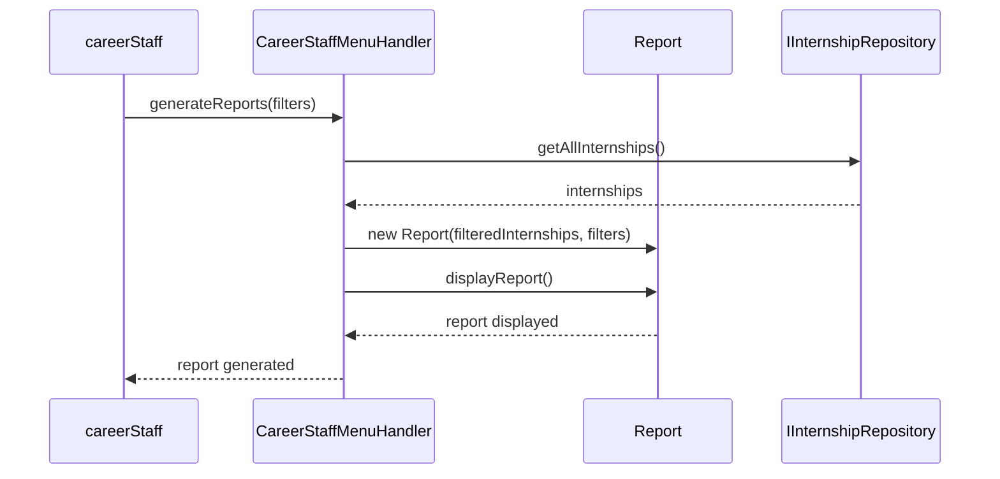
```mermaid
sequenceDiagram
    participant careerStaff
    participant CareerStaffMenuHandler
    participant Report
    participant IInternshipRepository

    careerStaff->>CareerStaffMenuHandler: generateReports(filters)
    CareerStaffMenuHandler->>IInternshipRepository: getAllInternships()
    IInternshipRepository-->>CareerStaffMenuHandler: internships
    CareerStaffMenuHandler->>Report: new Report(filteredInternships, filters)
    CareerStaffMenuHandler->>Report: displayReport()
    Report-->>CareerStaffMenuHandler: report displayed
    CareerStaffMenuHandler-->>careerStaff: report generated

```

### Menu Navigation with Handlers

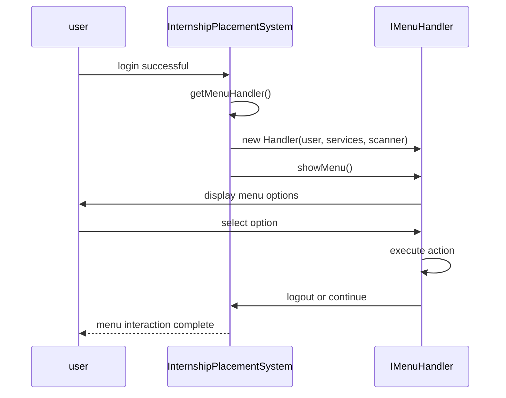
```mermaid
sequenceDiagram
    participant user
    participant InternshipPlacementSystem
    participant IMenuHandler

    user->>InternshipPlacementSystem: login successful
    InternshipPlacementSystem->>InternshipPlacementSystem: getMenuHandler()
    InternshipPlacementSystem->>IMenuHandler: new Handler(user, services, scanner)
    InternshipPlacementSystem->>IMenuHandler: showMenu()
    IMenuHandler->>user: display menu options
    user->>IMenuHandler: select option
    IMenuHandler->>IMenuHandler: execute action
    IMenuHandler->>InternshipPlacementSystem: logout or continue
    InternshipPlacementSystem-->>user: menu interaction complete

```

### Approving Company Representative Account

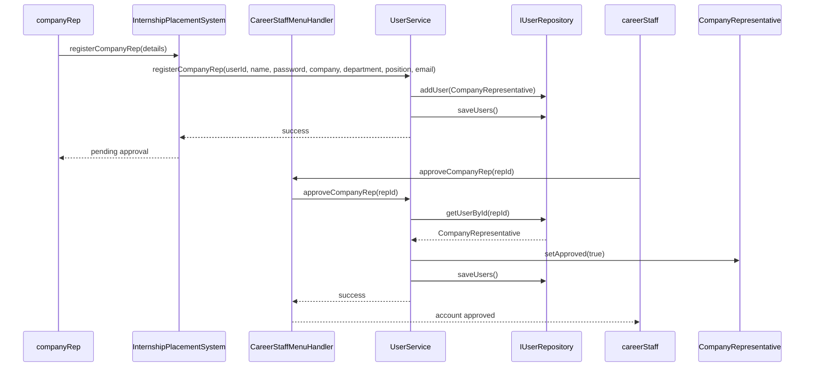
```mermaid
sequenceDiagram
    participant companyRep
    participant InternshipPlacementSystem
    participant CareerStaffMenuHandler
    participant UserService
    participant IUserRepository

    companyRep->>InternshipPlacementSystem: registerCompanyRep(details)
    InternshipPlacementSystem->>UserService: registerCompanyRep(userId, name, password, company, department, position, email)
    UserService->>IUserRepository: addUser(CompanyRepresentative)
    UserService->>IUserRepository: saveUsers()
    UserService-->>InternshipPlacementSystem: success
    InternshipPlacementSystem-->>companyRep: pending approval

    careerStaff->>CareerStaffMenuHandler: approveCompanyRep(repId)
    CareerStaffMenuHandler->>UserService: approveCompanyRep(repId)
    UserService->>IUserRepository: getUserById(repId)
    IUserRepository-->>UserService: CompanyRepresentative
    UserService->>CompanyRepresentative: setApproved(true)
    UserService->>IUserRepository: saveUsers()
    UserService-->>CareerStaffMenuHandler: success
    CareerStaffMenuHandler-->>careerStaff: account approved

```

### Approving Internship by Staff

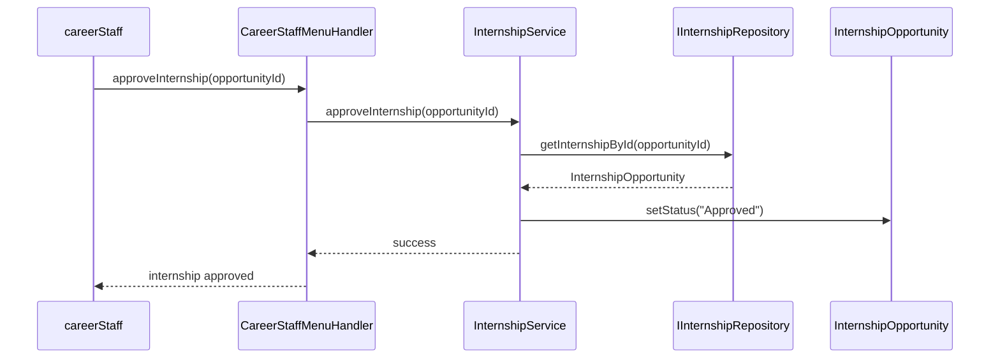
```mermaid
sequenceDiagram
    participant careerStaff
    participant CareerStaffMenuHandler
    participant InternshipService
    participant IInternshipRepository

    careerStaff->>CareerStaffMenuHandler: approveInternship(opportunityId)
    CareerStaffMenuHandler->>InternshipService: approveInternship(opportunityId)
    InternshipService->>IInternshipRepository: getInternshipById(opportunityId)
    IInternshipRepository-->>InternshipService: InternshipOpportunity
    InternshipService->>InternshipOpportunity: setStatus("Approved")
    InternshipService-->>CareerStaffMenuHandler: success
    CareerStaffMenuHandler-->>careerStaff: internship approved

```

### Batch Application Submission

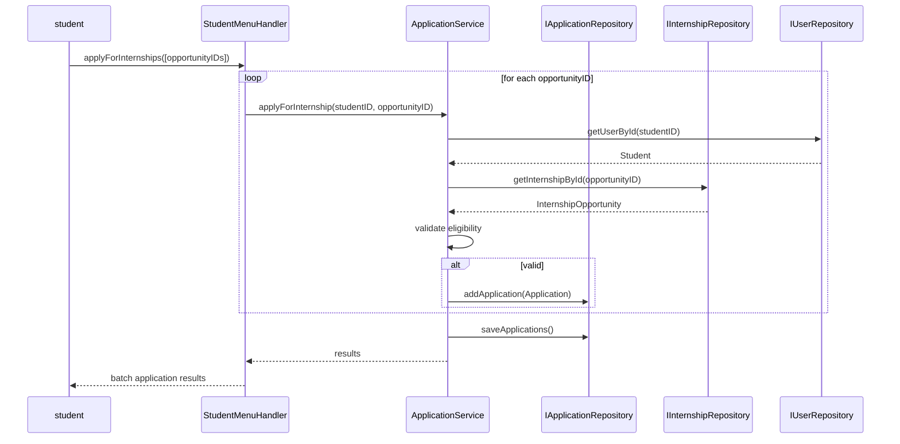
```mermaid
sequenceDiagram
    participant student
    participant StudentMenuHandler
    participant ApplicationService
    participant IApplicationRepository
    participant IInternshipRepository
    participant IUserRepository

    student->>StudentMenuHandler: applyForInternships([opportunityIDs])
    loop for each opportunityID
        StudentMenuHandler->>ApplicationService: applyForInternship(studentID, opportunityID)
        ApplicationService->>IUserRepository: getUserById(studentID)
        IUserRepository-->>ApplicationService: Student
        ApplicationService->>IInternshipRepository: getInternshipById(opportunityID)
        IInternshipRepository-->>ApplicationService: InternshipOpportunity
        ApplicationService->>ApplicationService: validate eligibility
        alt valid
            ApplicationService->>IApplicationRepository: addApplication(Application)
        end
    end
    ApplicationService->>IApplicationRepository: saveApplications()
    ApplicationService-->>StudentMenuHandler: results
    StudentMenuHandler-->>student: batch application results

```

### Password Change

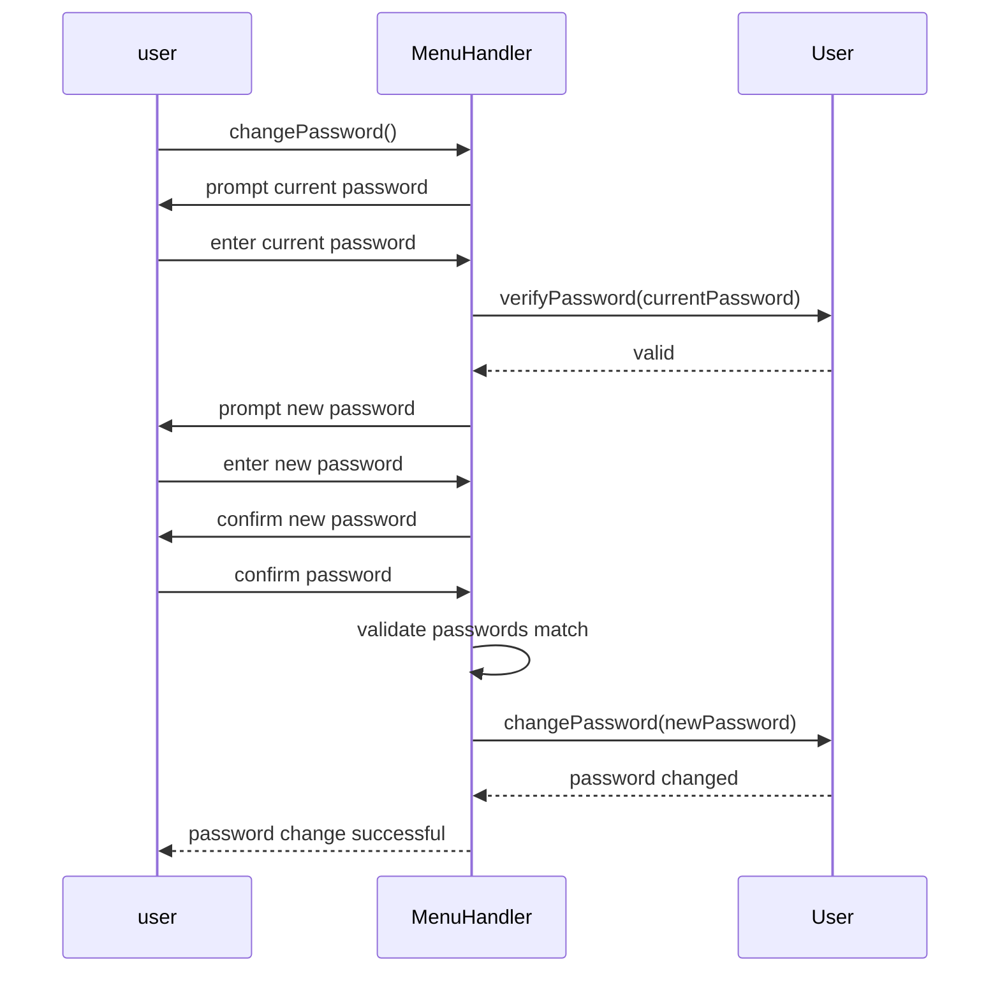
```mermaid
sequenceDiagram
    participant user
    participant MenuHandler
    participant User

    user->>MenuHandler: changePassword()
    MenuHandler->>user: prompt current password
    user->>MenuHandler: enter current password
    MenuHandler->>User: verifyPassword(currentPassword)
    User-->>MenuHandler: valid
    MenuHandler->>user: prompt new password
    user->>MenuHandler: enter new password
    MenuHandler->>user: confirm new password
    user->>MenuHandler: confirm password
    MenuHandler->>MenuHandler: validate passwords match
    MenuHandler->>User: changePassword(newPassword)
    User-->>MenuHandler: password changed
    MenuHandler-->>user: password change successful

```

### Logout Process

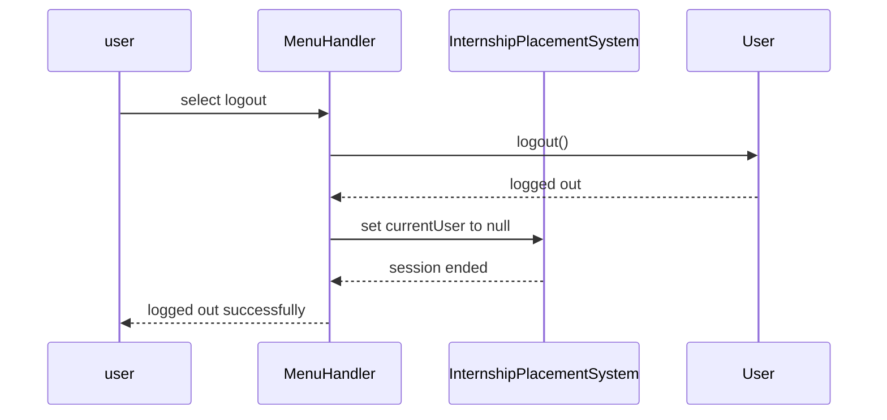
```mermaid
sequenceDiagram
    participant user
    participant MenuHandler
    participant InternshipPlacementSystem
    participant User

    user->>MenuHandler: select logout
    MenuHandler->>User: logout()
    User-->>MenuHandler: logged out
    MenuHandler->>InternshipPlacementSystem: set currentUser to null
    InternshipPlacementSystem-->>MenuHandler: session ended
    MenuHandler-->>user: logged out successfully

```

### Filter Management

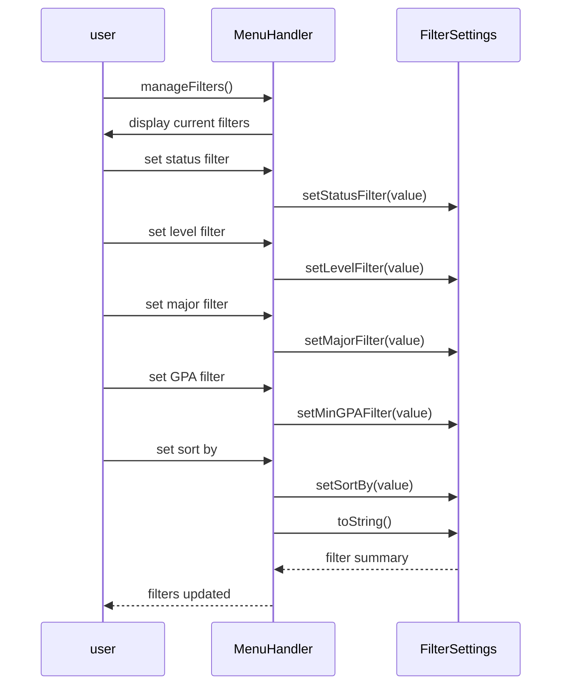
```mermaid
sequenceDiagram
    participant user
    participant MenuHandler
    participant FilterSettings

    user->>MenuHandler: manageFilters()
    MenuHandler->>user: display current filters
    user->>MenuHandler: set status filter
    MenuHandler->>FilterSettings: setStatusFilter(value)
    user->>MenuHandler: set level filter
    MenuHandler->>FilterSettings: setLevelFilter(value)
    user->>MenuHandler: set major filter
    MenuHandler->>FilterSettings: setMajorFilter(value)
    user->>MenuHandler: set GPA filter
    MenuHandler->>FilterSettings: setMinGPAFilter(value)
    user->>MenuHandler: set sort by
    MenuHandler->>FilterSettings: setSortBy(value)
    MenuHandler->>FilterSettings: toString()
    FilterSettings-->>MenuHandler: filter summary
    MenuHandler-->>user: filters updated

```

### Viewing Applications for Company Reps

```mermaid
sequenceDiagram
    participant companyRep
    participant CompanyRepMenuHandler
    participant ApplicationService
    participant IApplicationRepository

    companyRep->>CompanyRepMenuHandler: viewApplications()
    CompanyRepMenuHandler->>ApplicationService: getApplicationsForCompanyRep(repId)
    ApplicationService->>IApplicationRepository: getAllApplications()
    IApplicationRepository-->>ApplicationService: all applications
    ApplicationService->>ApplicationService: filter by repId
    ApplicationService-->>CompanyRepMenuHandler: rep applications
    CompanyRepMenuHandler-->>companyRep: display applications

```

### Toggling Internship Visibility

```mermaid
sequenceDiagram
    participant companyRep
    participant CompanyRepMenuHandler
    participant InternshipService
    participant IInternshipRepository

    companyRep->>CompanyRepMenuHandler: toggleVisibility(opportunityId, visible)
    CompanyRepMenuHandler->>InternshipService: toggleVisibility(opportunityId, visible)
    InternshipService->>IInternshipRepository: getInternshipById(opportunityId)
    IInternshipRepository-->>InternshipService: InternshipOpportunity
    InternshipService->>InternshipOpportunity: setVisibility(visible)
    InternshipService-->>CompanyRepMenuHandler: success
    CompanyRepMenuHandler-->>companyRep: visibility toggled

```
