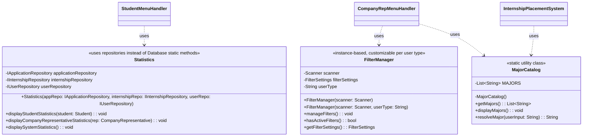
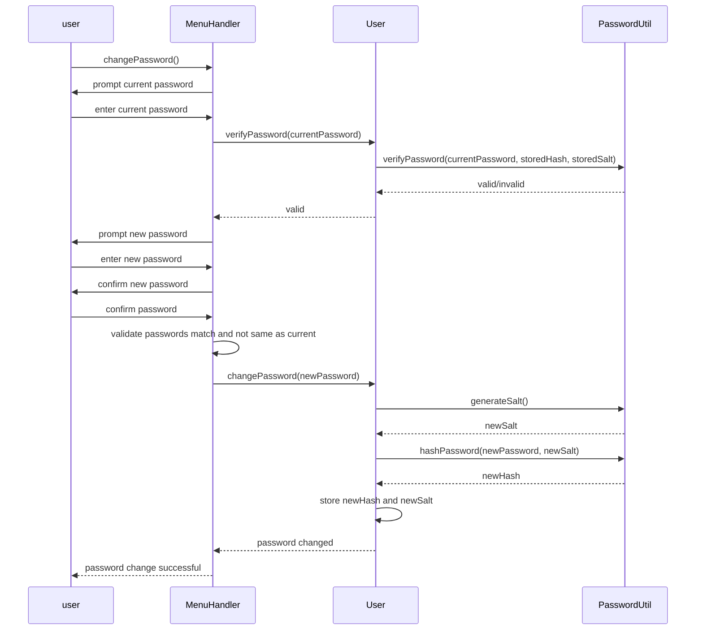

# UML Diagrams

This document contains the UML diagrams for the refactored Internship Placement System.

---

## Recent Updates (as of Nov 22, 2025)

- **Statistics**: Updated student and company representative statistics to include withdrawn applications in acceptance counts, added withdrawal rates, and provided additional insights like GPA and unique companies applied to.
- **ReportManager**: Updated detailed internship reports to display all application statuses (including withdrawn and withdrawal requested) for comprehensive visibility.
- **Application Status Handling**: Improved handling of withdrawal requests in statistics, counting them under previous status until approval and including withdrawn applications in success metrics.
- **Slot Management**: Slots are now considered filled for applications with status "Successful", "Confirmed", or "Withdrawal Requested". Prevents new applications when slots are full. Displays capped at max slots to avoid overfilled indicators.
- **Application Submission**: Students cannot apply to internships that are at capacity (filled slots >= max slots).
- **SOLID Principles**: All changes maintain SRP, OCP, LSP, ISP, DIP.

---

## UML Class Diagram (Key Changes)



---

## Integration Notes

- All menu handlers now use try-catch for error handling.
- MajorCatalog is the single source of truth for majors.
- FilterManager userType parameter customizes menu for company reps.
- Student statistics show eligible internships and active application count.

---

## Architecture Notes

**Service Layer Pattern**: UI handlers interact via services (`UserService`, `InternshipService`, `ApplicationService`). Domain objects delegate persistence to repositories. Legacy `Database` class fully removed.

**SOLID Principles Enforcement**:

- **Single Responsibility**: Handlers = UI orchestration; Services = business rules + validation; Repositories = persistence; Domain objects = state + light invariants.
- **Dependency Inversion**: High-level code depends on interfaces (`IUserRepository`, `IInternshipRepository`, `IApplicationRepository`).
- **Open/Closed**: New persistence strategies can be added behind repository interfaces. New user types can extend `User` without modifying existing code.
- **Liskov Substitution**: Code works with `User` base type; polymorphic methods eliminate `instanceof` checks.
- **Security**: Password hashing with salt; comprehensive input validation; secure data handling.

**Data Layer Status**:

- **Complete Repository Migration**: All classes now use repository pattern exclusively
- **No Legacy Database Usage**: `Database` class fully removed from active code paths
- **Dependency Injection**: All repositories properly injected with correct initialization order
- **Security**: Password hashing implemented with secure storage
- **Validation**: Comprehensive input validation at service layer
- **Performance**: Optimized algorithms using Java streams and efficient data structures
- **Testing**: Comprehensive automated test suite with 13 tests covering all major functionality
- **MajorCatalog**: Centralized major list for consistency across student registration, internship creation, and filtering
- **FilterManager Customization**: Company representatives see filtered menu options (no "Company" sort) using userType parameter
- **Error Handling**: Consistent try-catch blocks in all menu handlers following SOLID principles
- **Recent Updates**: Student internship viewing now shows all matching major/GPA internships with ineligibility reasons displayed. Statistics eligibility checks now include year restrictions. Filtering integrated into internship viewing for improved UX.

## Status Model

The system uses the following application and internship statuses:

- Application: `Pending`, `Successful`, `Unsuccessful`, `Confirmed`, `Withdrawn`, `Withdrawal Requested`, `Withdrawal Rejected`
- Internship: `Pending`, `Approved`, `Rejected`, `Filled`

## Security Model

- **Password Storage**: SHA-256 hashing with random salt for all user passwords
- **Input Validation**: Comprehensive validation at service layer for all user inputs
- **Data Protection**: No plain text password storage in memory or persistent files
- **Session Security**: Proper logout and session management

## Business Rules

**Application Constraints**:

- Students can have a maximum of 3 active applications (excludes `Withdrawn` and `Unsuccessful`).
- Students with a `Confirmed` internship **cannot** apply to new internships.
- Students cannot reapply to internships they manually withdrew from.

**Status Transitions**:

- `Withdrawal Requested` → `Withdrawal Rejected`: Restores `previousStatus` (typically `Successful` or `Confirmed`).
- `Successful` → `Confirmed`: Auto-withdraws all other applications for that student.

**Input Validation Rules**:

- User ID: 3-20 characters, alphanumeric
- Name: 2-50 characters, required
- Password: minimum 6 characters, hashed with salt
- Year of Study: 1-4 range
- Major: must match predefined list (Computer Science, Computer Engineering, etc.)
- GPA: 0.0-5.0 range
- Department/Position: 2-50 characters
- Email: basic format validation

## Testing Framework

### Automated Test Architecture

The system includes a comprehensive automated testing framework with the following structure:

```
test/
├── TestFramework.java       # Core assertion utilities
├── TestRunner.java          # Main test orchestrator
├── UserServiceTest.java     # Authentication & validation tests
├── RepositoryTest.java      # Data persistence tests
└── BusinessLogicTest.java   # Business rule tests
```

### Test Coverage

**UserService Tests (6 tests)**:

- Student, Staff, and Company Rep authentication
- Invalid credential rejection
- Registration input validation (user ID, GPA ranges)

**Repository Tests (5 tests)**:

- CSV file loading and parsing
- Data retrieval by ID
- Repository initialization
- ID generation functionality

**Business Logic Tests (2 tests)**:

- GPA-based eligibility filtering
- Internship validation rules

### Enhanced Testing Features

**Verbose Output**:

- Detailed logging of test conditions and object types (ASCII-compatible)
- Value comparison showing expected vs actual results
- Step-by-step verification of test assertions

**Confirmation Bias Protection**:

- Tests run against production code (not simplified test versions)
- Object type verification ensures correct return types
- Comprehensive assertion checking prevents false positives

**Testing Mode**:

- Application can run in testing mode for automated verification
- Isolated test environment prevents interference with production data
- Detailed reporting with pass rates and failure analysis

**Total**: 24 comprehensive manual test scenarios covering all system functionality with detailed expected behaviors

### Test Execution

Follow the comprehensive manual testing procedures in `docs/TESTING_GUIDE.md` for complete system validation.

**Error Messages**:

- Application rejections include detailed explanations with `[BLOCKED]` or `[ERROR]` prefixes.
- Registration failures provide specific validation error details.
- Context provided: current values vs requirements, related application details.

## UML Class Diagram

```mermaid
classDiagram
    class PasswordUtil {
        +generateSalt(): String
        +hashPassword(password: String, salt: String): String
        +verifyPassword(password: String, hash: String, salt: String): bool
        <<static utility class>>
    }

    class UIHelper {
        -UIHelper()
        +printWelcomeBanner(): void
        +printMainMenu(): void
        +printRegistrationMenu(): void
        +printGoodbyeMessage(): void
        +printLoginHeader(): void
        +printSuccessMessage(message: String): void
        +printErrorMessage(message: String): void
        +printWarningMessage(message: String): void
        +printSectionHeader(title: String): void
        +printDivider(): void
        +printStudentMenu(): void
        +printCompanyRepMenu(): void
        +printCareerStaffMenu(): void
        <<static utility class>>
    }

    class MajorCatalog {
        -List~String~ MAJORS
        -MajorCatalog()
        +getMajors(): List~String~
        +displayMajors(): void
        +resolveMajor(userInput: String): String
        <<static utility class>>
    }

    class User {
        <<abstract>>
        -String userID
        -String name
        -String passwordHash
        -String salt
        -boolean isLoggedIn
        +User(userID: String, name: String, password: String)
        +User(userID: String, name: String, passwordHash: String, salt: String)
        +login(password: String): bool
        +logout(): void
        +changePassword(newPassword: String): void
        +verifyPassword(password: String): bool
        +getUserID(): String
        +getName(): String
        +getPasswordHash(): String
        +getSalt(): String
        +isLoggedIn(): bool
        +createMenuHandler(internshipService, applicationService, userService, scanner): IMenuHandler*
        +isStudent(): bool
        +isCompanyRepresentative(): bool
        +isCareerCenterStaff(): bool
        +asStudent(): Student
        +asCompanyRepresentative(): CompanyRepresentative
        +asCareerCenterStaff(): CareerCenterStaff
    }

     class Student {
         -int yearOfStudy
         -String major
         -double gpa
         -IInternshipRepository internshipRepository
         -IApplicationRepository applicationRepository
         +viewEligibleInternships(): List~InternshipOpportunity~
         +applyForInternship(opportunityID: String): bool
         +viewApplications(): List~Application~
         +acceptInternship(applicationID: String): void
         +requestWithdrawal(applicationID: String): void
         +isEligibleForInternship(opportunity: InternshipOpportunity): bool
         +getIneligibilityReason(opportunity: InternshipOpportunity): String
         +getYearOfStudy(): int
         +getMajor(): String
         +getGpa(): double
         +createMenuHandler(internshipService, applicationService, userService, scanner): IMenuHandler
         +isStudent(): bool
         +asStudent(): Student
         -datesOverlap(start1: Date, end1: Date, start2: Date, end2: Date): boolean
     }

     class CompanyRepresentative {
         -String companyName
         -String department
         -String position
         -boolean isApproved
         -String email
         -IInternshipRepository internshipRepository
         -IApplicationRepository applicationRepository
         -boolean isRejected
         +createInternship(title: String, description: String, level: String, preferredMajor: String, openingDate: Date, closingDate: Date, maxSlots: int, minGPA: double): bool
         +viewApplications(): List~Application~
         +viewApplications(opportunityID: String): List~Application~
         +processApplication(applicationID: String, approve: boolean): bool
         +getPendingApplications(): List~Application~
         +toggleVisibility(opportunityID: String, visible: bool): void
         +getCompanyName(): String
         +getDepartment(): String
         +getPosition(): String
         +isApproved(): bool
         +isRejected(): bool
         +setRejected(rejected: bool): void
         +setApproved(approved: bool): void
         +getEmail(): String
         +createMenuHandler(internshipService, applicationService, userService, scanner): IMenuHandler
         +isCompanyRepresentative(): bool
         +asCompanyRepresentative(): CompanyRepresentative
     }

     class CareerCenterStaff {
         -String staffDepartment
         -IUserRepository userRepository
         -IInternshipRepository internshipRepository
         -IApplicationRepository applicationRepository
         +processCompanyRep(repID: String, approve: boolean): bool
         +processInternship(opportunityID: String, approve: boolean): bool
         +processWithdrawal(applicationID: String, approve: boolean): bool
         +getPendingCompanyReps(): List~CompanyRepresentative~
         +getPendingInternships(): List~InternshipOpportunity~
         +getWithdrawalRequests(): List~Application~
         +generateReports(filters: Map~String,String~): Report
         +getStaffDepartment(): String
         +createMenuHandler(internshipService, applicationService, userService, scanner): IMenuHandler
         +isCareerCenterStaff(): bool
         +asCareerCenterStaff(): CareerCenterStaff
     }

    class InternshipOpportunity {
        -String opportunityID
        -String title
        -String description
        -String level
        -String preferredMajor
        -Date openingDate
        -Date closingDate
        -String status
        -int maxSlots
        -boolean visibility
        -double minGPA
        -CompanyRepresentative createdBy
        +isOpen(): bool
        +isVisible(): bool
        +getOpportunityID(): String
        +getTitle(): String
        +setTitle(title: String): void
        +getDescription(): String
        +setDescription(description: String): void
        +getLevel(): String
        +setLevel(level: String): void
        +getPreferredMajor(): String
        +setPreferredMajor(major: String): void
        +getOpeningDate(): Date
        +setOpeningDate(date: Date): void
        +getClosingDate(): Date
        +setClosingDate(date: Date): void
        +getStatus(): String
        +setStatus(status: String): void
        +getMaxSlots(): int
        +setMaxSlots(slots: int): void
        +isVisibility(): bool
        +setVisibility(visibility: bool): void
        +getMinGPA(): double
        +setMinGPA(minGPA: double): void
        +getCreatedBy(): CompanyRepresentative
    }

    class Application {
        -String applicationID
        -Student applicant
        -InternshipOpportunity opportunity
        -String status
        -Date appliedDate
        -boolean manuallyWithdrawn
        -String previousStatus
        +Application(applicationID: String, applicant: Student, opportunity: InternshipOpportunity, status: String)
        +Application(applicationID: String, applicant: Student, opportunity: InternshipOpportunity, status: String, appliedDate: Date)
        +updateStatus(newStatus: String): void
        +getApplicationID(): String
        +getApplicant(): Student
        +getOpportunity(): InternshipOpportunity
        +getStatus(): String
        +getAppliedDate(): Date
        +isManuallyWithdrawn(): boolean
        +setManuallyWithdrawn(withdrawn: boolean): void
        +getPreviousStatus(): String
    }

    %% Database class removed - all functionality migrated to repository pattern

    class Report {
        -List~InternshipOpportunity~ opportunities
        -Map~String,String~ filters
        +displayReport(): void
        +getOpportunities(): List~InternshipOpportunity~
        +getFilters(): Map~String,String~
    }

    class ReportManager {
        -static ReportManager instance
        -IInternshipRepository internshipRepository
        -IApplicationRepository applicationRepository
        -ReportManager()
        +getInstance(): ReportManager
        +initialize(internshipRepository: IInternshipRepository, applicationRepository: IApplicationRepository): void
        +generateReport(filters: Map~String,String~): Report
        +displayDetailedReport(report: Report): void
        +getApplicationStatistics(): Map~String,Integer~
        +getInternshipStatistics(): Map~String,Integer~
        <<singleton>>
    }

    class FilterSettings {
        -String statusFilter
        -String levelFilter
        -String majorFilter
        -double minGPAFilter
        -String sortBy
        +setStatusFilter(status: String): void
        +setLevelFilter(level: String): void
        +setMajorFilter(major: String): void
        +setMinGPAFilter(minGPA: double): void
        +setSortBy(sortBy: String): void
        +hasActiveFilters(): bool
        +clearFilters(): void
        +applyFilters(opportunities: List~InternshipOpportunity~): List~InternshipOpportunity~
        +toString(): String
    }

    class FilterManager {
        -Scanner scanner
        -FilterSettings filterSettings
        -String userType
        +FilterManager(scanner: Scanner)
        +FilterManager(scanner: Scanner, userType: String)
        +manageFilters(): void
        +hasActiveFilters(): bool
        +getFilterSettings(): FilterSettings
        <<instance-based, customizable per user type>>
    }

    class Statistics {
        -IApplicationRepository applicationRepository
        -IInternshipRepository internshipRepository
        -IUserRepository userRepository
        +Statistics(appRepo: IApplicationRepository, internshipRepo: IInternshipRepository, userRepo: IUserRepository)
        +displayStudentStatistics(student: Student): void
        +displayCompanyRepresentativeStatistics(rep: CompanyRepresentative): void
        +displaySystemStatistics(): void
        <<uses repositories instead of Database static methods>>
    }

    class IUserRepository {
        +getAllUsers(): List~User~
        +getUserById(userId: String): User
        +addUser(user: User): void
        +removeUser(userId: String): void
        +saveUsers(): void
        +generateCompanyRepId(): String
    }

    class CsvUserRepository {
        +getAllUsers(): List~User~
        +getUserById(userId: String): User
        +addUser(user: User): void
        +removeUser(userId: String): void
        +saveUsers(): void
        +generateCompanyRepId(): String
    }

    class IInternshipRepository {
        +getAllInternships(): List~InternshipOpportunity~
        +getInternshipById(opportunityId: String): InternshipOpportunity
        +addInternship(internship: InternshipOpportunity): void
        +removeInternship(opportunityId: String): void
        +saveInternships(): void
        +generateInternshipId(): String
    }

    class CsvInternshipRepository {
        -IUserRepository userRepository
        +CsvInternshipRepository(userRepository: IUserRepository)
        +getAllInternships(): List~InternshipOpportunity~
        +getInternshipById(opportunityId: String): InternshipOpportunity
        +addInternship(internship: InternshipOpportunity): void
        +removeInternship(opportunityId: String): void
        +saveInternships(): void
        +generateInternshipId(): String
    }

    class IApplicationRepository {
        +getAllApplications(): List~Application~
        +getApplicationById(applicationId: String): Application
        +addApplication(application: Application): void
        +saveApplications(): void
        +generateApplicationId(): String
    }

    class CsvApplicationRepository {
        -IUserRepository userRepository
        -IInternshipRepository internshipRepository
        +CsvApplicationRepository(userRepository: IUserRepository, internshipRepository: IInternshipRepository)
        +getAllApplications(): List~Application~
        +getApplicationById(applicationId: String): Application
        +addApplication(application: Application): void
        +saveApplications(): void
        +generateApplicationId(): String
    }

    class UserService {
        -IUserRepository userRepository
        +login(userId: String, password: String): User
        +registerStudent(userId: String, name: String, password: String, yearOfStudy: int, major: String, gpa: double): bool
        +registerStaff(userId: String, name: String, password: String, department: String): bool
        +registerCompanyRep(userId: String, name: String, password: String, company: String, department: String, position: String, email: String): bool
        +approveCompanyRep(repId: String): void
        +isUserIdAvailable(userId: String, allowRejectedCompanyRep: bool): bool
        +getUserRepository(): IUserRepository
        -isValidUserId(userId: String): bool
        -isValidName(name: String): bool
        -isValidPassword(password: String): bool
        -isValidYearOfStudy(year: int): bool
        -isValidMajor(major: String): bool
        -isValidGpa(gpa: double): bool
        -isValidDepartment(department: String): bool
        -isValidCompanyName(company: String): bool
        -isValidPosition(position: String): bool
        -isValidEmail(email: String): bool
    }

    class InternshipService {
        -IInternshipRepository internshipRepository
        -IUserRepository userRepository
        +createInternship(userId: String, title: String, description: String, level: String, preferredMajor: String, openingDate: Date, closingDate: Date, maxSlots: int, minGPA: double): bool
        +approveInternship(opportunityId: String): void
        +rejectInternship(opportunityId: String): void
        +getAllInternships(): List~InternshipOpportunity~
        +getInternship(id: String): InternshipOpportunity
        +toggleVisibility(opportunityId: String, visible: bool): void
        +getInternshipRepository(): IInternshipRepository
    }


     class ApplicationService {
         -IApplicationRepository applicationRepository
         -IInternshipRepository internshipRepository
         -IUserRepository userRepository
         +applyForInternship(studentId: String, opportunityId: String): bool
         +approveApplication(applicationId: String): void
         +rejectApplication(applicationId: String): void
         +acceptInternship(applicationId: String): void
         +requestWithdrawal(applicationId: String): void
         +approveWithdrawal(applicationId: String): void
         +getAllApplicationsForStudent(studentId: String): List~Application~
         +getAllApplicationsForInternship(opportunityId: String): List~Application~
         +getApplicationsForStudent(studentId: String): List~Application~
         +getApplicationsForCompanyRep(repId: String): List~Application~
         +getApplicationsForInternship(opportunityId: String): List~Application~
         +getApplicationRepository(): IApplicationRepository
     }

    class IMenuHandler {
        +showMenu(): void
    }

    class StudentMenuHandler {
        -Student student
        -InternshipService internshipService
        -ApplicationService applicationService
        -UserService userService
        -Scanner scanner
        -FilterManager filterManager
        +showMenu(): void
    }

    class CompanyRepMenuHandler {
        -CompanyRepresentative rep
        -InternshipService internshipService
        -ApplicationService applicationService
        -UserService userService
        -Scanner scanner
        -FilterManager filterManager
        +showMenu(): void
    }

    class CareerStaffMenuHandler {
        -CareerCenterStaff staff
        -UserService userService
        -InternshipService internshipService
        -ApplicationService applicationService
        -Scanner scanner
        -FilterManager filterManager
        +showMenu(): void
    }

     class InternshipPlacementSystem {
         -Scanner scanner
         -User currentUser
         -IUserRepository userRepository
         -IInternshipRepository internshipRepository
         -IApplicationRepository applicationRepository
         -UserService userService
         -InternshipService internshipService
         -ApplicationService applicationService
         +main(args: String[]): void
         -run(): void
         -initializeServices(): void
         -showMainMenu(): void
         -showRegistrationMenu(): void
         -login(): void
         -registerStudent(): void
         -registerStaff(): void
         -registerCompanyRep(): void
         -showUserMenu(): void
     }

    User <|-- Student
    User <|-- CompanyRepresentative
    User <|-- CareerCenterStaff

    User ..> PasswordUtil : uses

     IUserRepository <|.. CsvUserRepository
     IInternshipRepository <|.. CsvInternshipRepository
     IApplicationRepository <|.. CsvApplicationRepository

     IMenuHandler <|.. StudentMenuHandler
     IMenuHandler <|.. CompanyRepMenuHandler
     IMenuHandler <|.. CareerStaffMenuHandler

    CompanyRepresentative "1" --> "0..5" InternshipOpportunity : creates >
    Student "1" --> "0..3" Application : applies >
    InternshipOpportunity "1" --> "*" Application : has >
    Application "*" --> "1" Student
    Application "*" --> "1" InternshipOpportunity

    CsvUserRepository ..> User : loads/saves
    CsvUserRepository ..> Student : creates
    CsvUserRepository ..> CompanyRepresentative : creates
    CsvUserRepository ..> CareerCenterStaff : creates

    CsvInternshipRepository ..> InternshipOpportunity : manages
    CsvInternshipRepository ..> IUserRepository : depends on

    CsvApplicationRepository ..> Application : manages
    CsvApplicationRepository ..> IUserRepository : depends on
    CsvApplicationRepository ..> IInternshipRepository : depends on

    UserService ..> IUserRepository : uses
    InternshipService ..> IInternshipRepository : uses
    InternshipService ..> IUserRepository : uses
    ApplicationService ..> IApplicationRepository : uses
    ApplicationService ..> IInternshipRepository : uses
    ApplicationService ..> IUserRepository : uses

    StudentMenuHandler ..> InternshipService : uses
    StudentMenuHandler ..> ApplicationService : uses
    StudentMenuHandler ..> UIHelper : uses
    CompanyRepMenuHandler ..> InternshipService : uses
    CompanyRepMenuHandler ..> ApplicationService : uses
    CompanyRepMenuHandler ..> UIHelper : uses
    CareerStaffMenuHandler ..> UserService : uses
    CareerStaffMenuHandler ..> InternshipService : uses
    CareerStaffMenuHandler ..> ApplicationService : uses
    CareerStaffMenuHandler ..> UIHelper : uses

    InternshipPlacementSystem ..> UIHelper : uses
    InternshipPlacementSystem ..> MajorCatalog : uses
    CompanyRepMenuHandler ..> MajorCatalog : uses

    Student ..> IInternshipRepository : uses
    Student ..> IApplicationRepository : uses
    CompanyRepresentative ..> IInternshipRepository : uses
    CompanyRepresentative ..> IApplicationRepository : uses
    CareerCenterStaff ..> IUserRepository : uses
    CareerCenterStaff ..> IInternshipRepository : uses
    CareerCenterStaff ..> IApplicationRepository : uses

     InternshipPlacementSystem ..> IUserRepository : injects
     InternshipPlacementSystem ..> IInternshipRepository : injects
     InternshipPlacementSystem ..> IApplicationRepository : injects
     InternshipPlacementSystem ..> UserService : injects
     InternshipPlacementSystem ..> InternshipService : injects
     InternshipPlacementSystem ..> ApplicationService : injects
     InternshipPlacementSystem ..> IMenuHandler : uses

    CareerCenterStaff ..> Report : creates
    Report ..> InternshipOpportunity : contains

    ReportManager ..> IInternshipRepository : uses
    ReportManager ..> IApplicationRepository : uses
    CareerStaffMenuHandler ..> ReportManager : uses

    Statistics ..> IApplicationRepository : uses
    Statistics ..> IInternshipRepository : uses
    Statistics ..> IUserRepository : uses
    Statistics ..> Student : analyzes
    Statistics ..> CompanyRepresentative : analyzes
    Statistics ..> InternshipOpportunity : analyzes
    Statistics ..> Application : analyzes

```

## UML Sequence Diagrams

### Secure Login with Password Hashing


### Service-Based Application Submission


### System Initialization with Proper Dependency Order


### User Registration with Comprehensive Validation


### User Login via Services


### Creating Internship via Services


### Approving Application via Services


### Accepting Internship via Services


### Requesting Withdrawal via Services


### Approving Withdrawal via Services


### Viewing Statistics via Services


### Generating Reports via Services


### Menu Navigation with Handlers


### Approving Company Representative Account


### Approving Internship by Staff


### Batch Application Submission


### Secure Password Change with Hashing



### Logout Process


### Filter Management


### Optimized Queue Processing

```mermaid
sequenceDiagram
    participant CareerStaff
    participant CareerCenterStaff
    participant ApplicationService
    participant IApplicationRepository
    participant IInternshipRepository

    CareerStaff->>CareerCenterStaff: processWithdrawal(applicationId, approve=true)
    CareerCenterStaff->>ApplicationService: approveWithdrawal(applicationId)
    ApplicationService->>IApplicationRepository: getApplicationById(applicationId)
    IApplicationRepository-->>ApplicationService: Application
    ApplicationService->>Application: updateStatus("Withdrawn")
    ApplicationService->>ApplicationService: check if confirmed slot freed
    ApplicationService->>CareerCenterStaff: processQueue(internship)
    CareerCenterStaff->>IApplicationRepository: getAllApplications()
    IApplicationRepository-->>CareerCenterStaff: all applications
    CareerCenterStaff->>CareerCenterStaff: filter by internshipId
    CareerCenterStaff->>CareerCenterStaff: count confirmed applications
    loop while slots available and queue not empty
        CareerCenterStaff->>CareerCenterStaff: find oldest queued application (by appliedDate/queuedDate)
        CareerCenterStaff->>Application: updateStatus("Confirmed")
        CareerCenterStaff->>CareerCenterStaff: withdraw other student applications
        CareerCenterStaff->>IApplicationRepository: saveApplications()
    end
    CareerCenterStaff->>ApplicationService: queue processing complete
    ApplicationService->>IApplicationRepository: saveApplications()
    ApplicationService-->>CareerCenterStaff: success
    CareerCenterStaff-->>CareerStaff: withdrawal processed, queue updated

```

### Viewing Applications for Company Reps

```mermaid
sequenceDiagram
    participant companyRep
    participant CompanyRepMenuHandler
    participant ApplicationService
    participant IApplicationRepository

    companyRep->>CompanyRepMenuHandler: viewApplications()
    CompanyRepMenuHandler->>ApplicationService: getApplicationsForCompanyRep(repId)
    ApplicationService->>IApplicationRepository: getAllApplications()
    IApplicationRepository-->>ApplicationService: all applications
    ApplicationService->>ApplicationService: filter by repId
    ApplicationService-->>CompanyRepMenuHandler: rep applications
    CompanyRepMenuHandler-->>companyRep: display applications

```

### Toggling Internship Visibility

```mermaid
sequenceDiagram
    participant companyRep
    participant CompanyRepMenuHandler
    participant InternshipService
    participant IInternshipRepository

    companyRep->>CompanyRepMenuHandler: toggleVisibility(opportunityId, visible)
    CompanyRepMenuHandler->>InternshipService: toggleVisibility(opportunityId, visible)
    InternshipService->>IInternshipRepository: getInternshipById(opportunityId)
    IInternshipRepository-->>InternshipService: InternshipOpportunity
    InternshipService->>InternshipOpportunity: setVisibility(visible)
    InternshipService-->>CompanyRepMenuHandler: success
    CompanyRepMenuHandler-->>companyRep: visibility toggled

```
